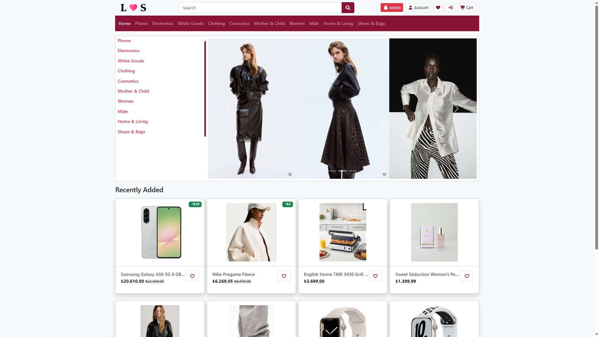
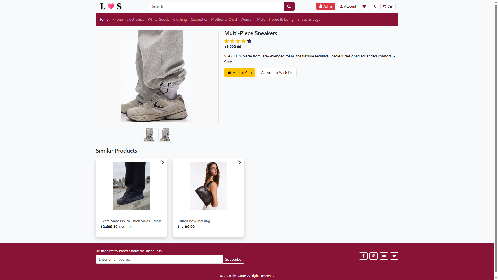
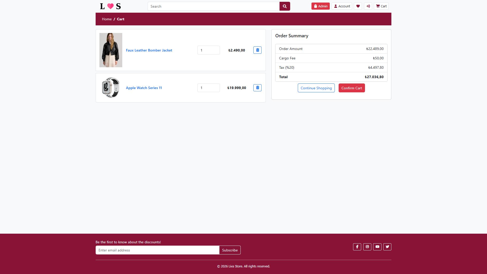
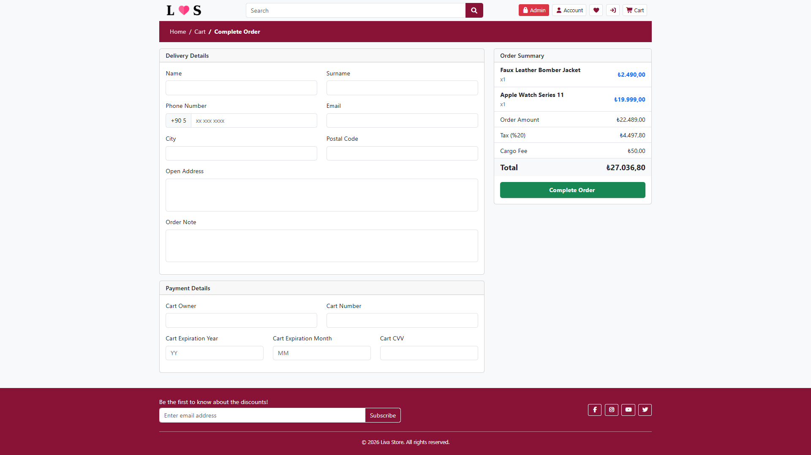
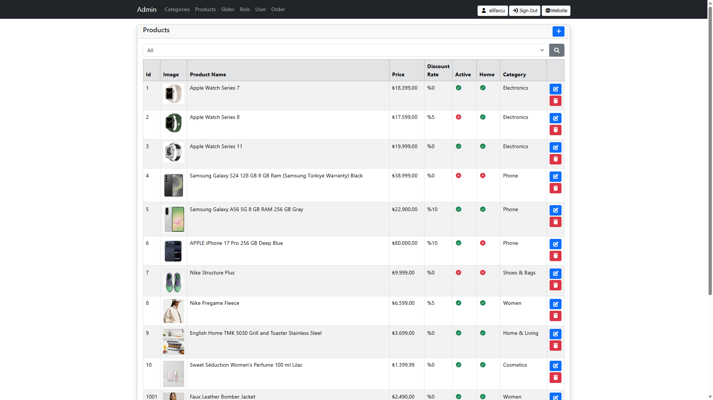

# 🛍️ Liva Store | E-Commerce Platform


<details>
<summary><strong>Click For English Description [EN]</strong></summary>
<br>
  
## 👋 About The Project

**Liva Store** is a robust, full-stack e-commerce application built with **ASP.NET Core 10.0 MVC** and designed with **N-Layer Architecture** principles.

**From Coursework to Custom Solution:**
While this project was initially incubated during a software training curriculum, **I have expanded its scope beyond the course material.** I replaced legacy libraries with modern alternatives, migrated the infrastructure to enterprise standards, and engineered custom business logic to simulate a real-world production environment.

I completely overhauled the UI to create the custom **"Liva Store"** brand identity and implemented critical features like **Discount management**, **MailKit notifications**, and **smart algorithms** that were not part of the original syllabus.

The project handles the entire e-commerce lifecycle: from dynamic product listing and smart cart management to secure payments with **Iyzico** and automated email notifications via **MailKit**.

---

## 🚀 Key Features & Custom Implementations

I have engineered several custom modules to enhance functionality and user experience beyond the standard boilerplate:

### 1. 🧠 Smart Product Listing & Sorting (Custom Logic)
* **Discount-First Algorithm:** The homepage automatically prioritizes products with the highest discount rates.
* **Stock Intelligence:** Products that are "Sold Out" are programmatically pushed to the bottom of the list to maintain visual engagement while keeping inventory visible.
* **Dynamic Badges:**
    * **Discount Badge:** Automatically calculates and displays the percentage saved (e.g., *"%20 OFF"*).
    * **Sold Out Badge:** Items with 0 stock are clearly marked and **cannot be added to the cart**.
* **Smart Pricing UI:** Displays the original price (strikethrough) alongside the new discounted price.

### 2. 🛒 Advanced Cart & Shipping Logic
* **Conditional Free Shipping:** Implemented a business rule where shipping is **free if the cart contains 5 or more items**. Otherwise, a flat rate (50 TL) is automatically applied.
* **Real-time Calculations:** The cart dynamically summarizes the subtotal, total discount amount, tax, and final grand total.

### 3. 💳 Payment & Security
* **Iyzico Integration:** Fully integrated **Iyzico Payment Gateway** for secure credit card processing (Sandbox mode).
* **Identity Management:** Users can securely update their profile (Email, Phone) and change passwords.
* **Secure Recovery:** Replaced legacy libraries with **MailKit** to build a secure "Forgot Password" flow that sends time-sensitive reset links.

### 4. 📧 Notification System (MailKit)
* **Automated Order Confirmation:** Upon a successful transaction, an HTML-based email is triggered via **MailKit**.
* **Deep Linking:** The email contains a direct link to the user's "My Orders" page (requires login) for immediate access to purchase details.

### 5. 🗄️ Admin Dashboard & Infrastructure
* **Full Control:** Admins can manage Products, Categories, Roles, Users, and Homepage Sliders.
* **Order Management:** Admins can view all incoming orders and their details.
* **Database Migration:** Successfully migrated the persistence layer from **SQLite** to **MS SQL Server** to ensure scalability.
</details>

<details>
<summary><strong>Türkçe Açıklama için Tıklayınız [TR]</strong></summary>
<br>

## 👋 Proje Hakkında
  
**Liva Store**, **ASP.NET Core 10.0 MVC** ile oluşturulmuş ve **N Katmanlı Mimari** prensipleriyle tasarlanmış, sağlam, tam kapsamlı bir e-ticaret uygulamasıdır.

**Ders İçeriğinden Özel Çözüme:**
Bu proje başlangıçta bir yazılım eğitim müfredatı kapsamında geliştirilmiş olsa da, kapsamını ders materyalinin ötesine genişlettim. Eski kütüphaneleri modern alternatiflerle değiştirdim, altyapıyı kurumsal standartlara taşıdım ve gerçek üretim ortamını simüle etmek için özel iş mantığı geliştirdim.

**"Liva Store"** marka kimliğini oluşturmak için kullanıcı arayüzünü elden geçirdim ve orijinal müfredatta yer almayan **İndirim yönetimi**, **MailKit bildirimleri** ve **akıllı algoritmalar** gibi kritik özellikleri ekledim.

Proje, dinamik ürün listelemesinden ve akıllı sepet yönetiminden, **Iyzico** ile güvenli ödemelere ve **MailKit** aracılığıyla otomatik e-posta bildirimlerine kadar tüm e-ticaret yaşam döngüsünü ele alıyor.

---

## 🚀 Temel Özellikler ve Özel Uygulamalar

Standart şablonun ötesinde işlevselliği ve kullanıcı deneyimini geliştirmek için çeşitli özel modüller tasarladım:

### 1. 🧠 Akıllı Ürün Listeleme ve Sıralama
* **İndirim Öncelikli Algoritma:** Ana sayfa, en yüksek indirim oranına sahip ürünleri otomatik olarak önceliklendirir.

* **Tükenen Ürünler:** "Tükendi" olan ürünler, görsel etkileşimi korurken envanteri görünür tutmak için programatik olarak listenin altına itilir.

* **Dinamik Etiketler:**

* **İndirim Etiketi:** Tasarruf edilen yüzdeyi otomatik olarak alır ve görüntüler (örneğin, *"%20 İNDİRİM"*).
* **Tükendi Etiketi:** Aktif olmayan ürünler açıkça işaretlenir ve **sepete eklenemez**.

* **Akıllı Fiyatlandırma Arayüzü:** Yeni indirimli fiyatın yanında orijinal fiyatı (üstü çizili) gösterir.

### 2. 🛒 Gelişmiş Sepet ve Kargo Mantığı
* **Koşullu Ücretsiz Kargo:** Sepette 5 veya daha fazla ürün varsa kargonun **ücretsiz** olduğu bir iş kuralı uygulandı. Aksi takdirde, otomatik olarak sabit bir ücret (50 TL) uygulanır.

* **Gerçek Zamanlı Hesaplamalar:** Sepet, ara toplamı, toplam indirim tutarını, vergiyi ve nihai toplam tutarı dinamik olarak özetler.

### 3. 💳 Ödeme ve Güvenlik
* **Iyzico Entegrasyonu:** Güvenli kredi kartı işlemleri için **Iyzico Ödeme Ağ Geçidi** ile tam entegrasyon.
* **Kimlik Yönetimi:** Kullanıcılar profillerini (E-posta, Telefon) güvenli bir şekilde güncelleyebilir ve şifrelerini değiştirebilir.

* **Güvenli Kurtarma:** Zaman duyarlı sıfırlama bağlantıları gönderen güvenli bir "Şifremi Unuttum" akışı oluşturmak için eski kütüphaneler **MailKit** ile değiştirildi.

### 4. 📧 Bildirim Sistemi (MailKit)
* **Otomatik Sipariş Onayı:** Başarılı bir işlemden sonra, **MailKit** aracılığıyla HTML tabanlı bir e-posta tetiklenir.

* **Derin Bağlantı:** E-posta, satın alma ayrıntılarına anında erişim için kullanıcının "Siparişlerim" sayfasına (giriş gerektirir) doğrudan bir bağlantı içerir.

### 5. 🗄️ Yönetici Paneli ve Altyapı
* **Tam Kontrol:** Yöneticiler Ürünleri, Kategorileri, Rolleri, Kullanıcıları ve Ana Sayfa Slider'larını yönetebilir.

* **Sipariş Yönetimi:** Yöneticiler gelen tüm siparişleri ve ayrıntılarını görüntüleyebilir.

* **Veritabanı Geçişi:** Ölçeklenebilirliği sağlamak için kalıcılık katmanı **SQLite**'tan **MS SQL Server**'a başarıyla taşındı.
</details>

## 📸 Screenshots

| Homepage & Discount Sorting | Product Detail & Similar Items |
|-------------------|---------------------------|
|  |  |

| Smart Cart & Shipping Rule | Secure Payment (Iyzico) |
|---------------|--------------------------|
|  |  |

|Automated Email Service | Admin Dashboard |
|---------------|--------------------------|
|  |  |

---

## 🛠️ Tech Stack

* **Framework:** ASP.NET Core 10.0 MVC
* **Language:** C#
* **Architecture:** N-Layered Architecture
* **Database:** MS SQL Server (Migrated from SQLite)
* **ORM:** Entity Framework Core (Code-First)
* **Identity:** ASP.NET Core Identity (Authentication & Authorization)
* **Libraries:**
    * **MailKit:** For modern and secure email services.
    * **Iyzico:** For payment processing.
* **Frontend:** HTML5, CSS3, Bootstrap 5, JavaScript
* **Tools:** Visual Studio Code, SSMS, Git

---

## ⚙️ Getting Started

To run Liva Store locally:

1.  **Clone the repo:**
    ```bash
    git clone [https://github.com/your-username/liva-store.git](https://github.com/your-username/liva-store.git)
    ```

2.  **Configure Database:**
    * Open `appsettings.json`.
    * Update `ConnectionStrings:DefaultConnection` with your local **SQL Server** connection string.
    * Update `EmailSettings` (SMTP) and `PaymentAPI` (Iyzico) keys.

3.  **Run Migrations:**
    ```bash
    dotnet ef database update
    ```

4.  **Run the App:**
    ```bash
    dotnet run
    ```

---

## 🚧 Roadmap & Status

This project is currently **Active & In Development**. Future planned updates include:
- [ ] Comment and Rating system for products.
- [ ] Advanced filtering (Price range, Brand).
- [ ] Wishlist functionality.
- [ ] Admin chart visualizations.

---

## 👩‍💻 **Elif**
*Computer Engineering Student @ Sakarya University*

<div align="left">
  <a href="https://linkedin.com/in/elifavcu" target="_blank">
    
  </a>
</div>
